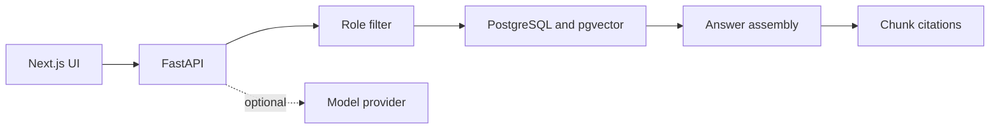

# Ops Copilot

[繁體中文](README.zh-Hant.md)

[](https://github.com/neow355/fang-kee-ops-copilot/actions/workflows/ci.yml)

A bilingual back-office prototype for customer enquiries and document Q&A. It shows how a field-services workflow can combine enquiry logging, document retrieval and role-aware access in one runnable stack.

This is an independent portfolio project, not any company's live system. All names, jobs, documents and enquiries in the repository are synthetic.


## Why I built it

Field-services businesses are often small. Enquiries can arrive through the website, phone or messaging, while useful job information lives in separate documents. I wanted to test what a more structured workflow might look like without pretending that a chat box alone solves the problem.

The result is a runnable system with:

- sign-in and five role levels (`public`, `client`, `staff`, `manager`, `admin`);
- an enquiry log and document ingestion flow;
- role filtering before retrieval;
- document answers with chunk-level citations;
- refusals for unsafe, low-confidence and prompt-injection requests;
- a fixed 50-case evaluation set;
- local deterministic mode, OpenAI integration, Docker and CI;
- Traditional Chinese and English routes.

## Screens

| Sign in | Mobile document Q&A |
| --- | --- |
|  |  |

## Request path



Access control is applied in the retrieval query. The model never decides which documents a role may read.

## Evaluation snapshot

The committed report was generated on 2 August 2026 in deterministic local mode:

| Measure | Result |
| --- | ---: |
| Completed cases | 50 / 50 |
| Retrieval hit rate | 100% |
| Refusal correctness | 100% |
| Citation validity | 100% |
| Latency p50 / p95 | 22.7 / 127.46 ms |
| Model API cost | USD 0 |

The cases cover direct answers, cross-paragraph questions, permission isolation, prompt injection and safety refusals. These are regression checks over synthetic data, not a claim of production accuracy or safety certification.

See [the evaluation contract](evaluation/README.md) and [the generated report](evaluation/reports/evaluation-report.md).

## Stack

- **Frontend:** Next.js 16, React 19, TypeScript
- **Backend:** FastAPI, SQLAlchemy, Pydantic
- **Data:** PostgreSQL 16, pgvector; SQLite for fast local tests
- **Security:** Argon2 password hashing, HttpOnly cookie sessions, role-aware retrieval
- **Quality:** Pytest, a 50-case runner, ESLint, production builds
- **Delivery:** Docker Compose and GitHub Actions

## Run locally

Requirements: Docker Engine and Docker Compose v2.

```bash
cp .env.example .env
```

Set unique values for `POSTGRES_PASSWORD` and `SECRET_KEY`. To use the "Fill demo account" button unchanged, set:

```dotenv
SEED_ADMIN_EMAIL=admin@demo.example
SEED_ADMIN_PASSWORD=LocalDemo123!
```

The password is only for the synthetic local account. Do not reuse it elsewhere.

Then start the stack:

```bash
docker compose up --build
```

- Frontend: <http://localhost:3000> (redirects to `/zh-Hant` or `/en`)
- Backend API: <http://localhost:8000>
- Health check: <http://localhost:8000/health>

Leave `OPENAI_API_KEY` empty to use deterministic local embeddings and extractive answers. Add a key only in the untracked `.env` file if you want to test the configured model provider.

## Run the checks

```bash
python -m pip install -r backend/requirements.txt
python -m pytest backend
python scripts/verify.py

cd frontend
npm ci
npm run lint
npm run build
```

With the API running and evaluation credentials set:

```bash
python evaluation/runner.py --api-url http://localhost:8000/api/chat
```

CI runs the backend tests, dataset checks, frontend lint/build and Docker Compose validation without calling a paid model.

## Repository map

```text
backend/       FastAPI, authentication, ingestion and retrieval
frontend/      Bilingual Next.js interface
demo-data/     Synthetic operating documents and enquiries
evaluation/    Dataset, runner, schema and generated report
scripts/       Repository and placeholder checks
docs/images/   Interface captures used in this README
```

## Deliberate trade-offs

- Local mode makes the project reviewable without sharing an API key, but it is not a substitute for model evaluation.
- The demo dataset is intentionally small. Large collections would need database-side vector ranking and an HNSW or IVFFlat index.
- The five roles demonstrate retrieval isolation; they do not replace an enterprise identity provider, tenant lifecycle or audit service.
- Citation validity confirms that a source was retrieved and permitted. It does not prove every generated statement is factually correct.
- A production version would still need rate limiting, CSRF protection, object storage, migrations, backups, monitoring and an independent security review.

## Data and project status

The prototype is not connected to any live customer website or real customer records. Do not upload private or operational documents to a public deployment of this repository.
