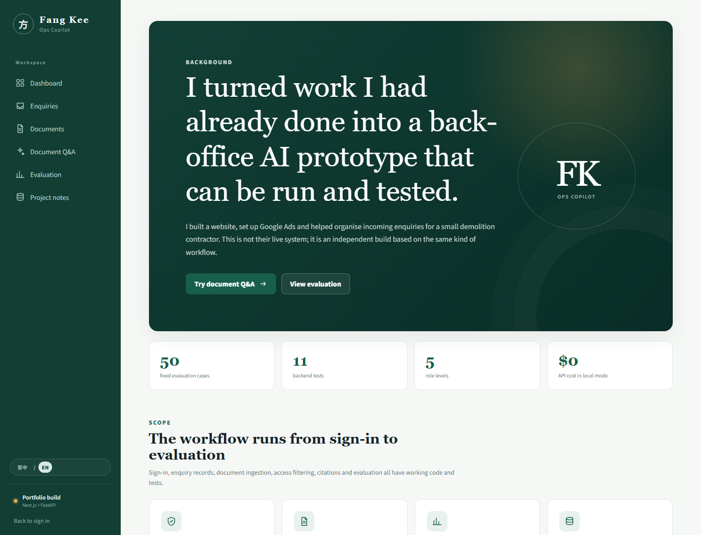
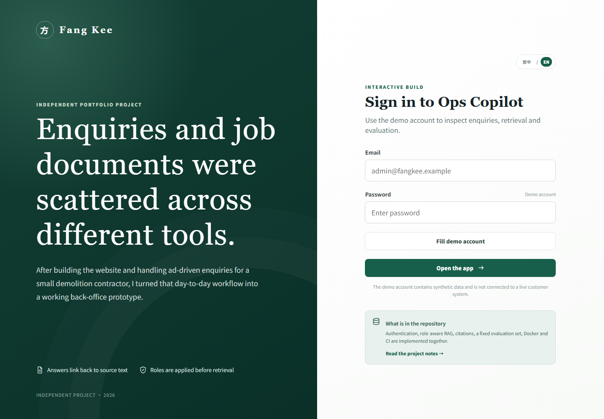
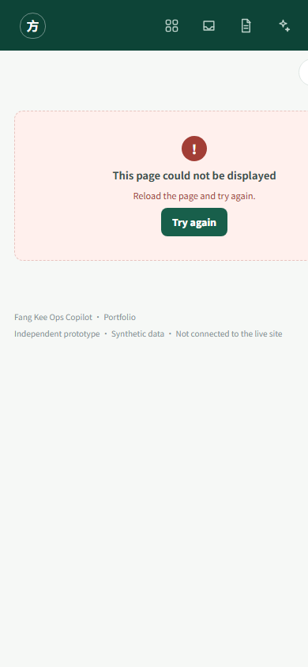
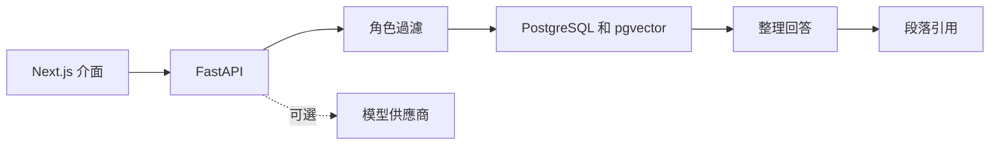

# Fang Kee Ops Copilot

[English](README.md)

這是一個處理客戶查詢和文件問答的雙語後台原型。我曾替一間小型清拆公司製作網站、設定 Google Ads，亦要協助整理查詢；這個專案源於那些實際工作。

它是獨立開發的作品集，不是公司正在使用的正式系統。程式庫內的人名、項目、文件和查詢均為合成資料。



## 為何做這個專案

這間公司的規模不大。查詢可能來自網站、電話或通訊軟件，工作資料則散落在不同文件。我想試做一套較有秩序的流程，同時避免把「加一個聊天介面」當成完整答案。

目前可以實際操作的部分包括：

- 登入和五種角色（`public`、`client`、`staff`、`manager`、`admin`）；
- 客戶查詢記錄及文件匯入；
- 檢索前按角色過濾；
- 附文件段落引用的問答；
- 對高風險、低信心及提示詞注入問題拒答；
- 固定的 50 題評估集；
- 本地確定性模式、OpenAI 整合、Docker 和 CI；
- 繁體中文及英文獨立網址。

## 介面

| 登入 | 手機版文件問答 |
| --- | --- |
|  |  |

## 一次問答經過的路徑



角色權限在資料庫檢索時已經套用，不會交由模型決定哪些文件可以讀取。

## 評估結果

程式庫內的報告在 2026 年 8 月 2 日以確定性本地模式產生：

| 項目 | 結果 |
| --- | ---: |
| 完成案例 | 50 / 50 |
| 檢索命中率 | 100% |
| 拒答正確率 | 100% |
| 引用有效率 | 100% |
| 延遲 p50 / p95 | 22.7 / 127.46 ms |
| 模型 API 成本 | USD 0 |

題目涵蓋直接回答、跨段落問題、權限隔離、提示詞注入及安全拒答。這些數字適合用來檢查程式改動有沒有令既有行為倒退，但不等於正式環境的準確率或安全認證。

詳細定義見[評估契約](evaluation/README.md)及[產生的報告](evaluation/reports/evaluation-report.md)。

## 技術棧

- **前端：** Next.js 16、React 19、TypeScript
- **後端：** FastAPI、SQLAlchemy、Pydantic
- **資料：** PostgreSQL 16、pgvector；本機測試使用 SQLite
- **安全：** Argon2 密碼雜湊、HttpOnly Cookie、角色感知檢索
- **品質：** Pytest、50 題 runner、ESLint、production build
- **交付：** Docker Compose、GitHub Actions

## 本機啟動

需要 Docker Engine 及 Docker Compose v2。

```bash
cp .env.example .env
```

為 `POSTGRES_PASSWORD` 和 `SECRET_KEY` 設定各自的隨機值。若要直接使用「填入展示帳戶」按鈕，請設定：

```dotenv
SEED_ADMIN_EMAIL=admin@fangkee.example
SEED_ADMIN_PASSWORD=LocalDemo123!
```

這個密碼只供本機合成帳戶使用，請勿在其他地方重用。

啟動服務：

```bash
docker compose up --build
```

- 前端：<http://localhost:3000>（按偏好導向 `/zh-Hant` 或 `/en`）
- 後端 API：<http://localhost:8000>
- 健康檢查：<http://localhost:8000/health>

`OPENAI_API_KEY` 留空時，系統使用可重現的本地嵌入向量和抽取式回答。要測試已設定的模型供應商，才把金鑰放在不受版本控制的 `.env`。

## 執行檢查

```bash
python -m pip install -r backend/requirements.txt
python -m pytest backend
python scripts/verify.py

cd frontend
npm ci
npm run lint
npm run build
```

API 運行並設定評估帳戶後：

```bash
python evaluation/runner.py --api-url http://localhost:8000/api/chat
```

CI 會執行後端測試、資料集檢查、前端 lint/build 及 Docker Compose 驗證，不會呼叫付費模型。

## 目錄

```text
backend/       FastAPI、登入、文件匯入和檢索
frontend/      雙語 Next.js 介面
demo-data/     合成營運文件和查詢
evaluation/    資料集、runner、schema 和評估報告
scripts/       程式庫及 placeholder 檢查
docs/images/   README 使用的介面截圖
```

## 刻意保留的取捨

- 本地模式讓檢視者不需分享 API 金鑰也能執行專案，但不能代替正式模型評估。
- 展示資料量刻意保持細小。較大資料集需要在資料庫執行向量排序，並加入 HNSW 或 IVFFlat 索引。
- 五種角色用來展示檢索隔離，不等於企業身分供應商、租戶生命週期或完整稽核。
- 引用有效代表來源曾經被檢索並符合權限，不代表模型產生的每句話都正確。
- 正式版本仍需要速率限制、CSRF 防護、物件儲存、migration、備份、監控及獨立安全審查。

## 資料與專案狀態

這個原型沒有接駁 [fangkeedemolition.com](https://fangkeedemolition.com/) 或真實客戶記錄；網站只提供工作流程背景。請勿把私人或營運文件上傳到此程式庫的公開部署。
